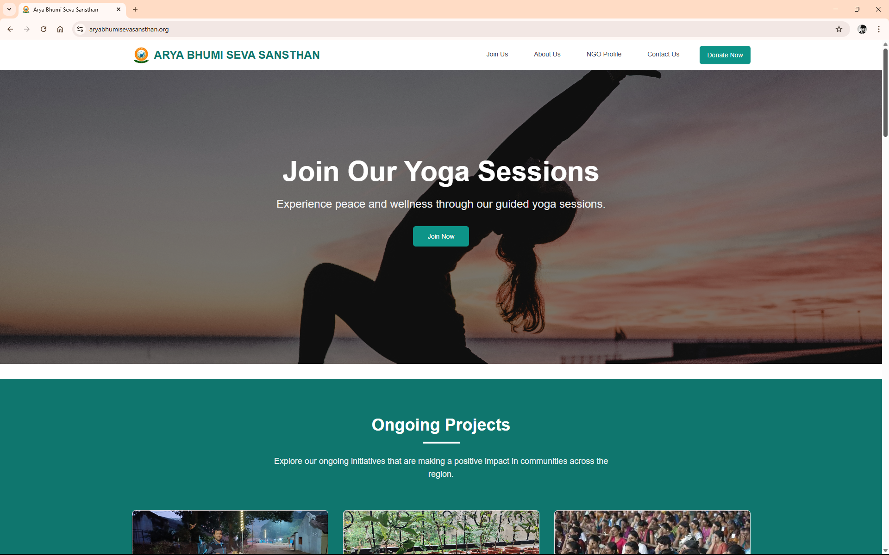
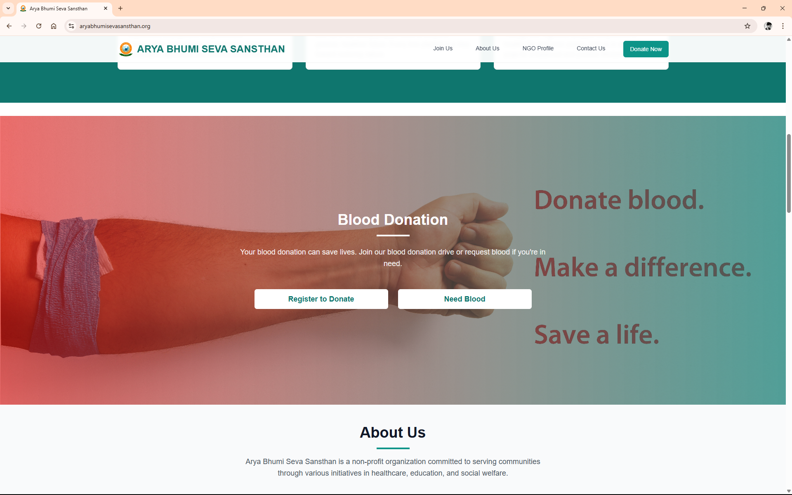
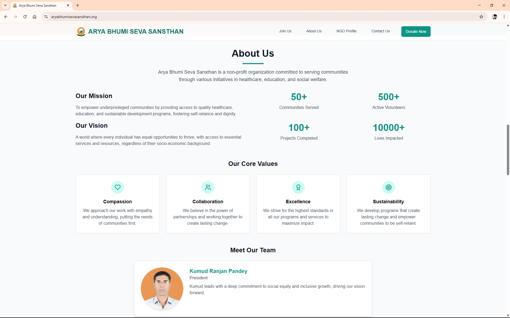

# 🌟 Arya Bhumi Seva Sansthan

<div align="center">
  
  
  [](https://nextjs.org/)
  [](https://www.typescriptlang.org/)
  [](https://tailwindcss.com/)
  [](https://supabase.com/)
</div>

## 📝 About

Arya Bhumi Seva Sansthan is a non-profit organization dedicated to serving communities through various initiatives in healthcare, education, and social welfare. This web application serves as the digital platform for the organization, enabling better outreach and service delivery.

## ✨ Features

- 🏥 Healthcare Initiatives
- 📚 Educational Programs
- 🤝 Social Welfare Services
- 📱 Responsive Design
- 🔒 Secure Authentication
- 🌐 Multi-language Support

## 🚀 Tech Stack

- **Frontend Framework:** Next.js 13
- **Language:** TypeScript
- **Styling:** Tailwind CSS
- **Database:** Supabase
- **Authentication:** Supabase Auth
- **Deployment:** Vercel

## 🛠️ Getting Started

### Prerequisites

- Node.js 18.x or later
- pnpm (recommended) or npm
- Supabase account

### Installation

1. Clone the repository:
   ```bash
   git clone https://github.com/abheeshakespeare/AryaBhumiSevaSanathan.git
   cd AryaBhumiSevaSanathan
   ```

2. Install dependencies:
   ```bash
   pnpm install
   ```

3. Set up environment variables:
   Create a `.env.local` file in the root directory and add:
   ```
   NEXT_PUBLIC_SUPABASE_URL=your_supabase_url
   NEXT_PUBLIC_SUPABASE_ANON_KEY=your_supabase_anon_key
   ```

4. Run the development server:
   ```bash
   pnpm dev
   ```

5. Open [http://localhost:3000](http://localhost:3000) in your browser.

## 📁 Project Structure

```
arya-bhumi-seva-sansthan/
├── app/              # Next.js app directory
├── components/       # Reusable UI components
├── lib/             # Utility functions and configurations
├── public/          # Static assets
├── styles/          # Global styles
├── utils/           # Helper functions
└── prisma/          # Database schema and migrations
```

## 🖼️ User Interface

Here are some screenshots of the Arya Bhumi Seva Sansthan web application:

<div align="center">
  
  <br/>
  <em>Home Page</em>
  <br/><br/>
  
  <br/>
  <em>BloodDonation</em>
  <br/><br/>
  
  <br/>
  <em>About Us Modal</em>
</div>


## 📞 Contact

For any queries or support, please reach out to us at:
- Email: [kumarabhishekmishra28@gmail.com](mailto:kumarabhishekmishra28@gmail.com)


---

<div align="center">
  Made with ❤️ by Abhishek Mishra
</div> 
